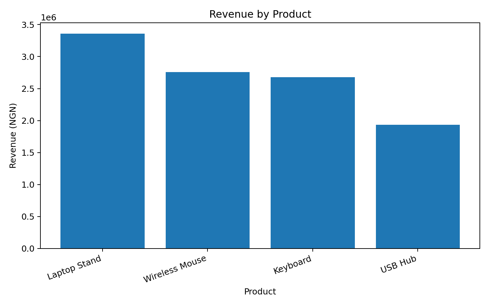
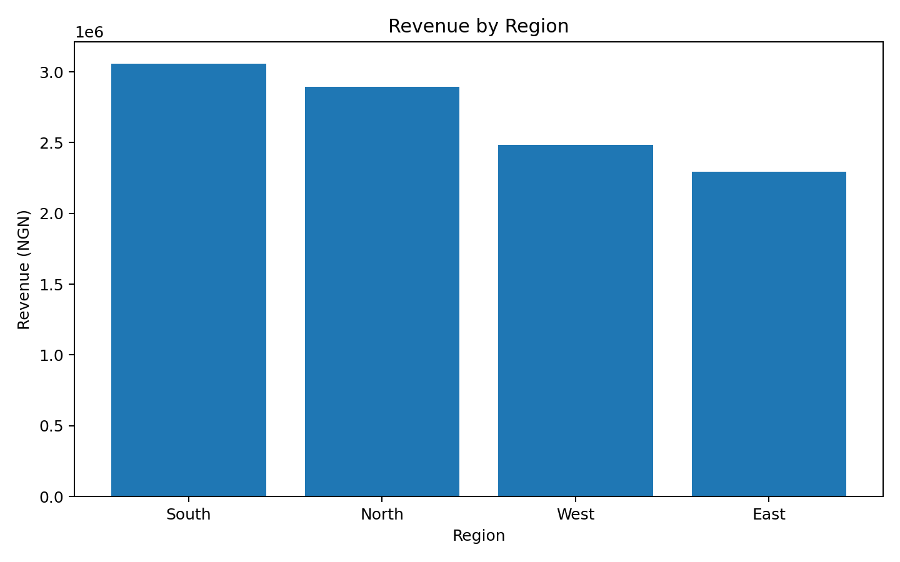
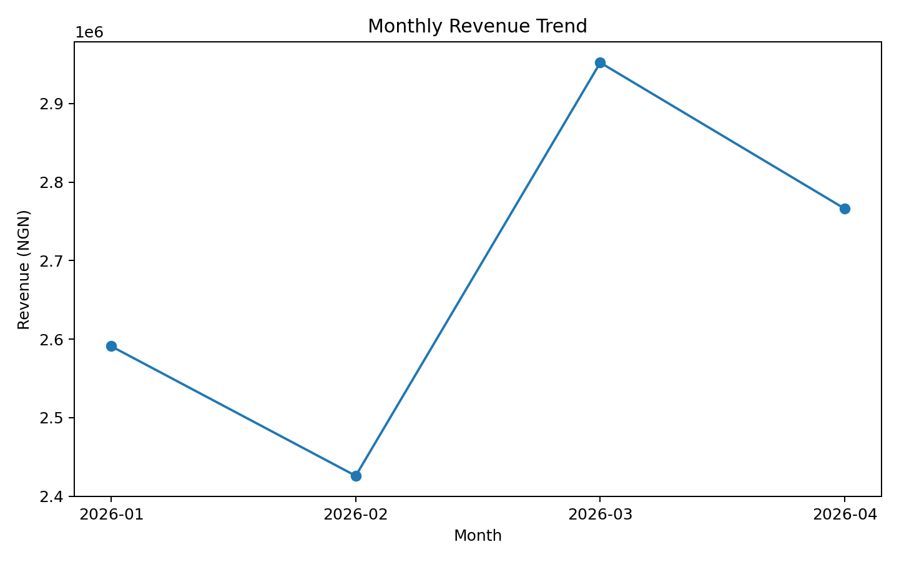

 My First Data Analysis – Fictional Sales Data
 Project Overview

This is a beginner data analysis project created to demonstrate basic data analysis and reporting skills using fictional sales data.

The project examines sales performance across different products, regions, and months.

Objective

The objectives of this analysis are to:

- Analyze sales performance
- Identify product sales patterns
- Compare sales across regions
- Examine monthly sales performance
- Practice data summarization and reporting

Dataset

The dataset contains fictional sales records with the following fields:

- Date
- Product
- Region
- Units Sold
- Revenue (NGN)

Note:All data used in this project is completely fictional and was created for learning and portfolio purposes.

 Tools Used

- Microsoft Excel
- GitHub

 Analysis Performed

The data was summarized by:

- Product
- Region
- Month

These summaries were used to examine sales volume and revenue performance.

Key Results

- Total units sold: 629
- Total fictional revenue: ₦10,735,000
- Sales performance was compared across four regions.
- Product performance was analyzed based on units sold and revenue.
- Monthly summaries were created to examine sales performance over time.

Key Insights

Product Performance

The Laptop Stand generated the highest revenue at ₦3,360,000 despite having the lowest unit sales at 96 units.

The USB Hub recorded the highest unit sales at 215 units but generated the lowest revenue at ₦1,935,000.

This demonstrates that unit volume does not necessarily translate into the highest revenue.

Regional Performance

The South region recorded the highest revenue at ₦3,058,000, followed by the North at ₦2,896,000.

The East recorded the lowest revenue at ₦2,296,000.

Monthly Performance

March recorded the highest sales volume at 173 units and the highest monthly revenue at ₦2,952,000.

February recorded the lowest sales volume at 141 units and the lowest monthly revenue at ₦2,426,000.

Business Recommendations

- Monitor the performance of high-revenue products such as the Laptop Stand.
- Investigate why products with higher unit sales generate lower revenue.
- Examine factors that may be contributing to stronger sales performance in the South region.
- Monitor monthly sales trends to identify opportunities for improving weaker months.

 Project Files

My_First_Data_Analysis.xlsx – Contains the fictional sales data, product summary, regional summary, and monthly summary.

 Purpose

This project is part of my journey toward developing practical data analysis, reporting, and data visualization skills.

Visualizations

Revenue by Product

Revenue by Region

Monthly Revenue Trend

Monthly Revenue Trend

